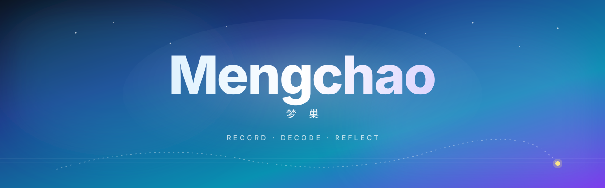

  

<h1 align="center">梦巢 · Mengchao</h1>

  <strong>RECORD · DECODE · REFLECT</strong> 
  AI 心理学梦境记录与解读工具

  
  &nbsp;
  

  
  
  
  

 

---

## ✨ 产品简介

**梦巢** 是一款融合 AI 心理学的梦境记录与解读工具，帮助你在每一个清醒的瞬间，**重新理解睡眠深处的自己**。

只需将刚醒来时脑海中那些零碎的画面倾倒出来——不需要完整，碎片就好——梦巢会结合你当时的情绪、梦中出现的人物或场景，以及昨天发生的事，为你生成一段**专属的梦境解读**。

更独特的是，**梦巢拥有"记忆"**。从第二个梦开始，它会主动调取你最近 5 个梦境，让 AI 跨越单次解读的局限，发现只属于你的潜意识规律，把每一个梦连成一幅完整的**自我画像**。

产品采用**端到端加密**，数据完全私密，不用于训练模型，并支持一键删除全部记录。设计风格沉浸、克制，宛如一座**夜空之下的私人巢穴**。梦巢坦诚声明自己是**心理学工具而非咨询替代品**，这份边界意识令人安心。

> 如果你好奇自己到底是谁，不妨从一个梦开始。

 

## 🪐 立即体验

**🌐 官网体验：[meng-chao.vercel.app](https://meng-chao.vercel.app/)**

无需安装 · 网页直达

 

## 🛸 关于 Innate Labs

> **Building AI-native products & agents for the next generation of founders.**

[Innate Labs](https://github.com/Innate-Labs) 致力于打造下一代 AI 原生产品与智能体（Agents）。
**梦巢** 是我们 **05 期** 学员作品中 **AI 助手类** 方向的优秀代表。

- 🌐 GitHub：<https://github.com/Innate-Labs>
- 🪐 产品官网：<https://meng-chao.vercel.app/>

 

---

  
    © 2026 <a href="https://github.com/Innate-Labs"><b>Innate Labs</b></a> &nbsp;·&nbsp;
    Crafted with 🌊 and ✨ AI &nbsp;·&nbsp;
    <a href="https://meng-chao.vercel.app/">meng-chao.vercel.app</a>
  

